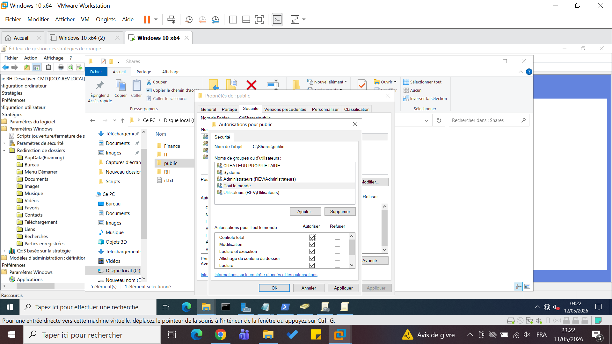
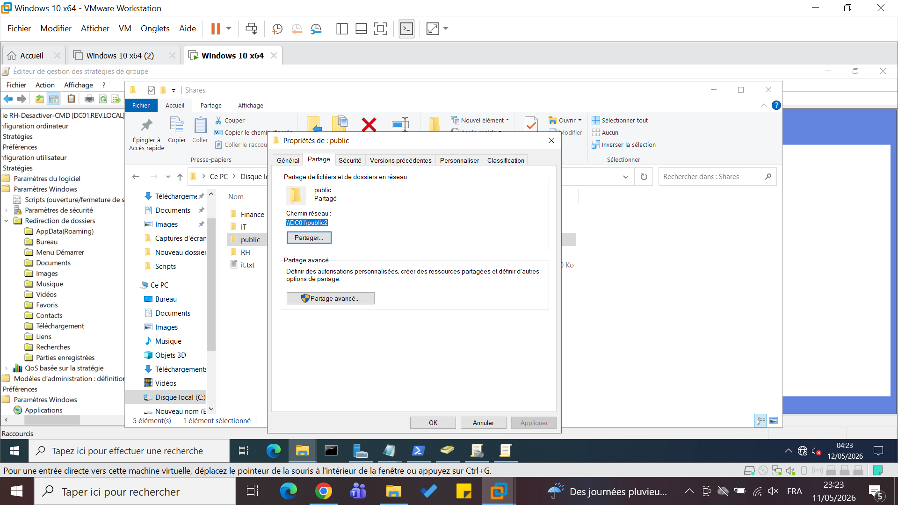
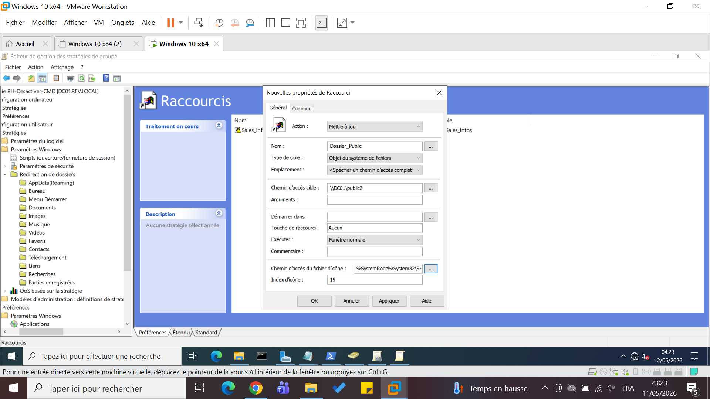
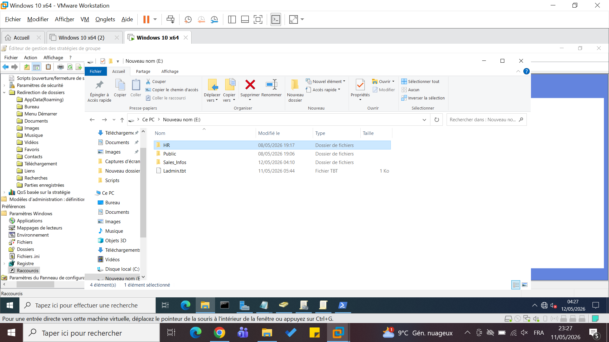
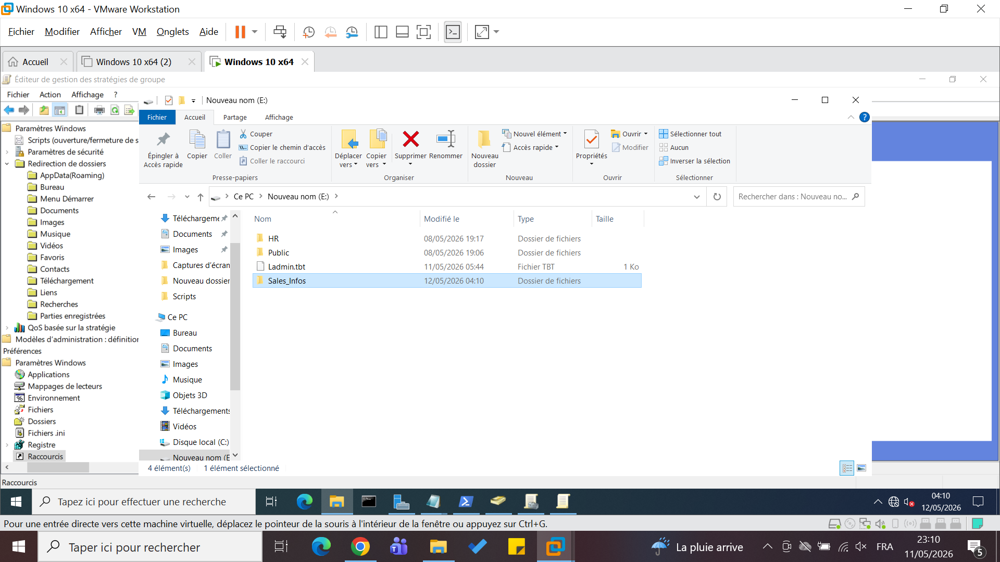
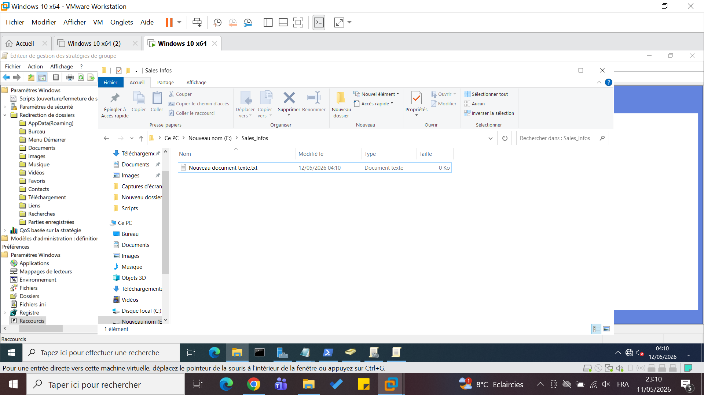
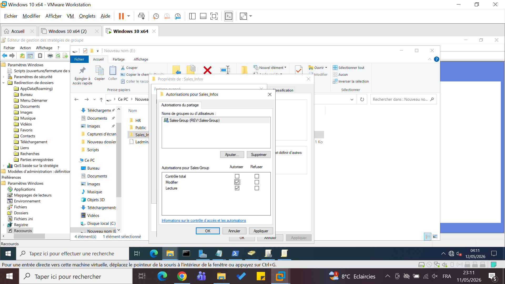
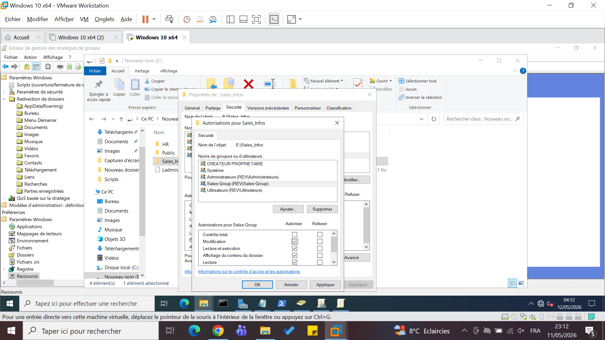
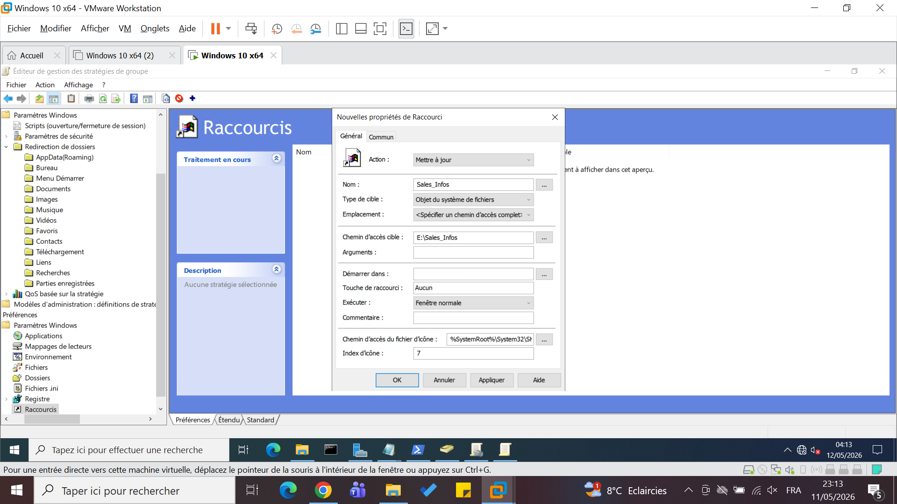
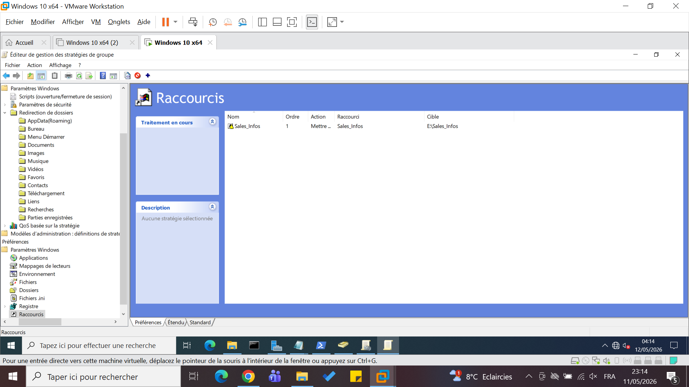

# 📁 Serveur de fichiers

## 🎯 Objectif
Gérer les accès aux fichiers et partages réseau.

---

## 📂 Dossiers partagés

### HR
- Accès : HR-Group
- Permissions :
  - Lire
  - Modifier
  - ❌ Supprimer interdit

## 🔗 Lecteur réseau

### Public Drive
- Accessible à tous
- Permissions complètes

### HR (H:)
- Assigné aux utilisateurs RH

## Résultat

---
Sales

 

## 💾 Quotas

- Limite : 2GB par utilisateur

## Résultat

---

## Résultat Vise:
- Données sécurisées
- Gestion des accès efficace
