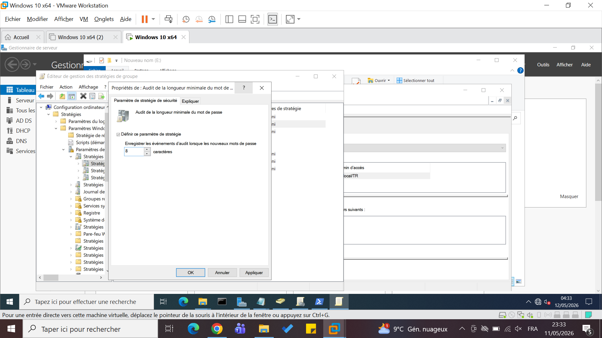
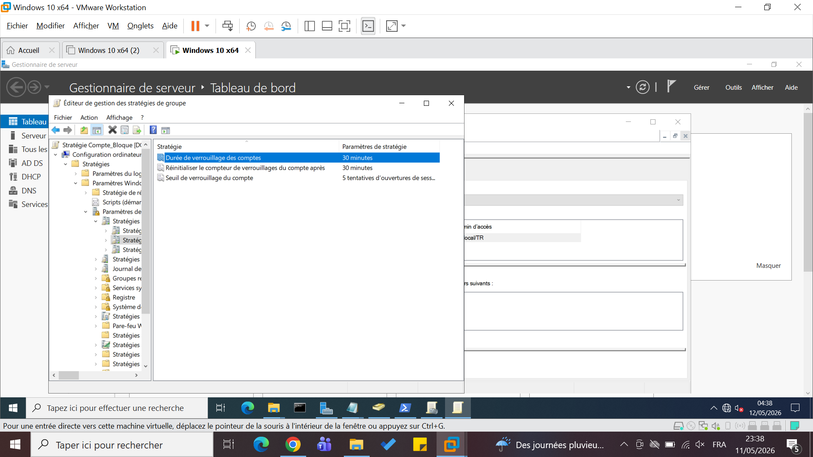
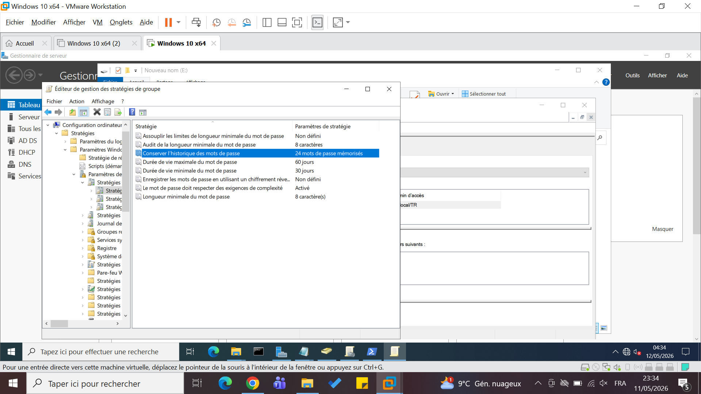

# 🔐 Sécurité

## Objectif
Renforcer la sécurité des comptes et systèmes.

---

## 🔑 Politique mot de passe

- Minimum : 6 caractères
- Complexité activée
- Expiration : 60 jours
- Historique : 3 mots de passe

---

## 🚫 Verrouillage compte

- 5 tentatives échouées
- Blocage : 30 minutes

---

## ❌ Restrictions exécutables

- Blocage des fichiers .exe
- Empêche installation non autorisée

---

## 🧠 Résultat

